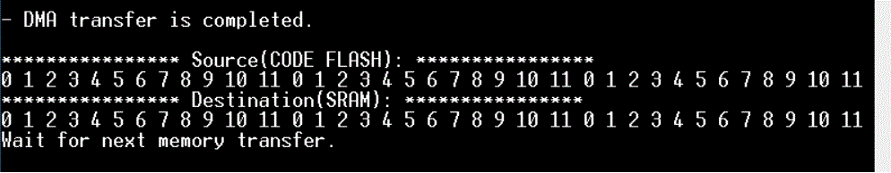

# M-DMA Memory Copy
**This code example demonstrates the transmission of data from memory to memory by Memory DMA (M-DMA), shows its operation, initial setting, and interrupt handling.**

## Device
The device used in this code example (CE) is:
- [TRAVEO™ T2G CYT4BF Series](https://www.infineon.com/cms/en/product/microcontroller/32-bit-traveo-t2g-arm-cortex-microcontroller/32-bit-traveo-t2g-arm-cortex-for-body/traveo-t2g-cyt4bf-series/)

## Board
The board used for testing is:
- TRAVEO™ T2G evaluation kit (`KIT_T2G-B-H_EVK`, `KIT_T2G-B-H_LITE`)

## Scope of work
This code example demonstrates the transmission of data from Code Flash to SRAM by M-DMA. M-DMA transfer is initiated using software triggers.

## Introduction

**M-DMA**

The TRAVEO™ T2G device supports two kinds of DMA controllers: Peripheral DMA (P-DMA) and Memory DMA (M-DMA). 
The main difference between the M-DMA and P-DMA controllers is that the M-DMA controller has dedicated channel logic (with channel state) for each channel, whereas the P-DMA reuses the channel logic for all channels.
The M-DMA controller is used to transfer data between memory and memory without CPU involvement. The following shows the functionality of M-DMA.
- Focuses on achieving high memory bandwidth for a small number of channels.
- Focuses on memory-to-memory data transfers (but it can also perform peripheral-to-memory and 
memory-to-peripheral data transfers).
- Uses a dedicated data transfer engine for each channel.
- A descriptor specifies the following data transfer specifications:
    - The source and destination address locations and the size of the transfer.
    - The actions of a channel; for example, generation of output triggers and interrupts.
    - Data transfer types can be single, 1D, or 2D as defined in the descriptor structure. These types essentially define the address sequences generated for source and destination. 1D and 2D transfers are used for “scatter gather” and other useful transfer operations.

More details can be found in [Technical Reference Manual (TRM)](https://www.cypress.com/documentation/technical-reference-manuals/traveo-ii-automotive-body-controller-high-family), [Registers TRM](https://www.cypress.com/documentation/technical-reference-manuals/traveo-t2g-tvii-b-h-8m-registers-body-controller-high) and [Data Sheet](https://www.cypress.com/documentation/datasheets/cyt4bf-datasheet-32-bit-arm-cortex-m7-microcontroller-traveo-ii-family).

## Hardware setup
This CE has been developed for:
- TRAVEO™ T2G evaluation kit (`KIT_T2G-B-H_EVK`) 
 
No changes are required from the board's default settings.

## Implementation
This design consists of M-DMA and a user button. The M-DMA is designed to initiate transfers by software triggers. Pressing the user button generates an interrupt. When interrupt occurs, M-DMA transfer is triggered by software. Then, M-DMA transfers 36 bytes data from a specified source address (Code Flash) to a destination address (SRAM). M-DMA will generate an interrupt when the transfer is complete.

**STDOUT setting**

Initialization of the GPIO for UART is done in the [cy_retarget_io_init()](https://infineon.github.io/retarget-io/html/group__group__board__libs.html#ga21265301bf6e9239845227c2aead9293) function.
- Initialize the pin specified by CYBSP_DEBUG_UART_TX as UART TX, the pin specified by CYBSP_DEBUG_UART_RX as UART RX (these pins are connected to KitProg3 COM port)
- The serial port parameters become to 8N1 and 115200 baud

**GPIO port pin initialization**

Initialization of the GPIO port pin is done once in the [cyhal_gpio_init()](https://infineon.github.io/mtb-hal-cat1/html/group__group__hal__gpio.html#gab93322030909d3af6a9fc1a3b2eccbaa) function.
- Initialize the pin specified by CYBSP_USER_BTN as input

Configuration of the GPIO interrupt is done once.
- Register a interrupt handler for user button by [cyhal_gpio_register_callback()](https://infineon.github.io/mtb-hal-cat1/html/group__group__hal__gpio.html#gaaf872e66c1934c8166f386a55e74707c) function with using structure [cyhal_gpio_callback_data_t](https://infineon.github.io/mtb-hal-cat1/html/group__group__hal__gpio.html#structcyhal__gpio__callback__data__t) as argument.
- GPIO interrupt is enabled by [cyhal_gpio_enable_event()](https://infineon.github.io/mtb-hal-cat1/html/group__group__hal__gpio.html#ga0e0346810451d9940d31bb6111153593) function.

**M-DMA initialization**

The M-DMA initialization is done in following steps.
- To disable M-DMA and channel, [Cy_DMAC_Disable()](https://infineon.github.io/mtb-pdl-cat1/pdl_api_reference_manual/html/group__group__dmac__block__functions.html#ga326f150b8c5856c36bf2f19672c03a71) and [Cy_DMAC_Channel_DeInit()](https://infineon.github.io/mtb-pdl-cat1/pdl_api_reference_manual/html/group__group__dmac__channel__functions.html#gaac669d8281a624e28c436e7ff8588ac3) is called.

- Source and destination addresses are specified the `DMAC_Descriptor_0_config.srcAddress` and `DMAC_Descriptor_0_config.dstAddress`. 

- To initialize DMA Descriptor, [Cy_DMAC_Descriptor_Init()](https://infineon.github.io/mtb-pdl-cat1/pdl_api_reference_manual/html/group__group__dmac__descriptor__functions.html#gad4204ef079b02d9afdd9328f0cd461f9) is called with using structure [cy_stc_dmac_descriptor_config_t](https://infineon.github.io/mtb-pdl-cat1/pdl_api_reference_manual/html/structcy__stc__dmac__descriptor__config__t.html) and [cy_stc_dmac_descriptor_t ](https://infineon.github.io/mtb-pdl-cat1/pdl_api_reference_manual/html/structcy__stc__dmac__descriptor__t.html) which are auto-coded by Device Configurator as argument.

- To initialize DMA channel, [Cy_DMAC_Channel_Init()](https://infineon.github.io/mtb-pdl-cat1/pdl_api_reference_manual/html/group__group__dmac__channel__functions.html#ga7b508e6cc332b4d009bf9b09ed6529b3) is called with using structure [cy_stc_dmac_channel_config_t](https://infineon.github.io/mtb-pdl-cat1/pdl_api_reference_manual/html/structcy__stc__dmac__channel__config__t.html) which are auto-coded by Device Configurator as argument.

    - *Figure 1. M-DMA setting* 

**Note:** This code example needs to set the source and destination address. Therefore, the `Store Config in Flash` checkbox in `Advanced` does not set.

Configuration of the M-DMA interrupt is done once.

- To set a priority for the M-DMA channel, [Cy_DMAC_Channel_SetPriority()](https://infineon.github.io/mtb-pdl-cat1/pdl_api_reference_manual/html/group__group__dmac__channel__functions.html#ga4e68ab04d5de2d6a1b31779741aa64db) is called, and interrupt is enabled by [Cy_DMAC_Channel_SetInterruptMask](https://infineon.github.io/mtb-pdl-cat1/pdl_api_reference_manual/html/group__group__dmac__channel__functions.html#gae0485c56ffe98283f8b9326ee6d516ae).

- To enable the M-DMA, [Cy_DMAC_Enable()](https://infineon.github.io/mtb-pdl-cat1/pdl_api_reference_manual/html/group__group__dmac__block__functions.html#ga3f45f389340c3282c59d6ffe6e5040b5) is called.

- Next, register a handler for M-DMA channel by [Cy_SysInt_Init()](https://infineon.github.io/mtb-pdl-cat1/pdl_api_reference_manual/html/group__group__sysint__functions.html#gab2ff6820a898e9af3f780000054eea5d).

- Last, `NVIC_EnableIRQ()` is called to enable IRQ.

**M-DMA Transfer**

- When pressing the user button is detected, the `HandleGPIOIntr` is called and set the `g_isInterrupt`.

- When set the `g_isInterrupt`, [Cy_DMAC_Channel_SetDescriptor()](https://infineon.github.io/mtb-pdl-cat1/pdl_api_reference_manual/html/group__group__dmac__channel__functions.html#ga0ea7589df07e40e6723dc7f992e6994b) is called with using structure [cy_stc_dmac_descriptor_t](https://infineon.github.io/mtb-pdl-cat1/pdl_api_reference_manual/html/structcy__stc__dmac__descriptor__t.html) which are auto-coded by Device Configurator as argument to sets a descriptor as current for the specified M-DMA channel.

- Then, M-DMA channel is enabled by [Cy_DMAC_Channel_Enable()](https://infineon.github.io/mtb-pdl-cat1/pdl_api_reference_manual/html/group__group__dmac__channel__functions.html#gab39e11c3ad72ebfd07cdd9840385769b), and initiate M-DMA transfer by [Cy_TrigMux_SwTrigger()](https://infineon.github.io/mtb-pdl-cat1/pdl_api_reference_manual/html/group__group__trigmux__functions.html#gad3c1d26d25a47bc4beca499bf0407c80).

- The `HandleDMACIntr` is called by DMA transfer completion, and set the `g_isComplete`.

- When the `g_isComplete` is set, `memcmp()` is called to check if the source data and destination data match.

**ISR of DMA transfer completion**

The ISR funtion for DMA transfer completion is `HandleDMACIntr`.

- At first, checking if the intended interrupt has occurred by [Cy_DMAC_Channel_GetInterruptStatusMasked()](https://infineon.github.io/mtb-pdl-cat1/pdl_api_reference_manual/html/group__group__dmac__channel__functions.html#ga586bd262ab7725b4588dde9516c88b1e) before start ISR proces.

- Then, set the `g_isComplete` after clearing the interrupt by [Cy_DMAC_Channel_ClearInterrupt()](https://infineon.github.io/mtb-pdl-cat1/pdl_api_reference_manual/html/group__group__dmac__channel__functions.html#ga31fbd71a93ff4332b8e8df56090f9423).

## Run and Test
For this example, a terminal emulator is required for displaying outputs. Install a terminal emulator if you do not have one. Instructions in this document use [Tera Term](https://ttssh2.osdn.jp/index.html.en).

After code compilation, perform the following steps to flashing the device:
1. Connect the board to your PC using the provided USB cable through the KitProg3 USB connector.
2. Open a terminal program and select the KitProg3 COM port. Set the serial port parameters to 8N1 and 115200 baud.
3. Program the board using one of the following:
    - Select the code example project in the Project Explorer.
    - In the **Quick Panel**, scroll down, and click **[Project Name] Program (KitProg3_MiniProg4)**.
4. After programming, the code example starts automatically. Confirm that the messages are displayed on the UART terminal.

 - *Figure 2. Terminal output on program startup* 

 - *Figure 3. Print out the result*  

5. You also can debug the example to step through the code. In the IDE, use the **[Project Name] Debug (KitProg3_MiniProg4)** configuration in the **Quick Panel**. For details, see the "Program and debug" section in the [Eclipse IDE for ModusToolbox™ software user guide](https://www.cypress.com/MTBEclipseIDEUserGuide)

**Note:** **(Only while debugging)** On the CM7 CPU, some code in `main()` may execute before the debugger halts at the beginning of `main()`. This means that some code executes twice ? once before the debugger stops execution, and again after the debugger resets the program counter to the beginning of `main()`. See [KBA231071](https://community.cypress.com/docs/DOC-21143) to learn about this and for the workaround.

## References

Relevant Application notes are:
- AN235305 - GETTING STARTED WITH TRAVEO™ T2G FAMILY MCUS IN MODUSTOOLBOX™
- [AN220191](https://www.infineon.com/dgdl/Infineon-AN220191_How_to_use_direct_memory_access_DMA_controller_in_TRAVEO_II_family-ApplicationNotes-v07_00-EN.pdf?fileId=8ac78c8c7cdc391c017d0d3aee0b678a) - How To Use Direct Memory Access (DMA) Controller In TRAVEO™ T2G FAMILY
- [AN219842](https://www.infineon.com/dgdl/Infineon-AN219842_How_to_use_interrupt_in_TRAVEO_II-ApplicationNotes-v07_00-EN.pdf?fileId=8ac78c8c7cdc391c017d0d3a490a6732) - How to use interrupt in TRAVEO™ II

ModusToolbox™ is available online:
- <https://www.infineon.com/modustoolbox>

Associated T2G MCUs can be found on:
- <https://www.infineon.com/cms/en/product/microcontroller/32-bit-traveo-t2g-arm-cortex-microcontroller/>

More code examples can be found on the GIT repository:
- [TRAVEO™ T2G Code examples](https://github.com/orgs/Infineon/repositories?q=mtb-t2g-&type=all&language=&sort=)

For additional trainings, visit our webpage:  
- [TRAVEO™ T2G trainings](https://www.infineon.com/cms/en/product/microcontroller/32-bit-traveo-t2g-arm-cortex-microcontroller/32-bit-traveo-t2g-arm-cortex-for-body/traveo-t2g-cyt4bf-series/#!trainings)

For questions and support, use the TRAVEO™ T2G Forum:  
- <https://community.infineon.com/t5/TRAVEO-T2G/bd-p/TraveoII>  
